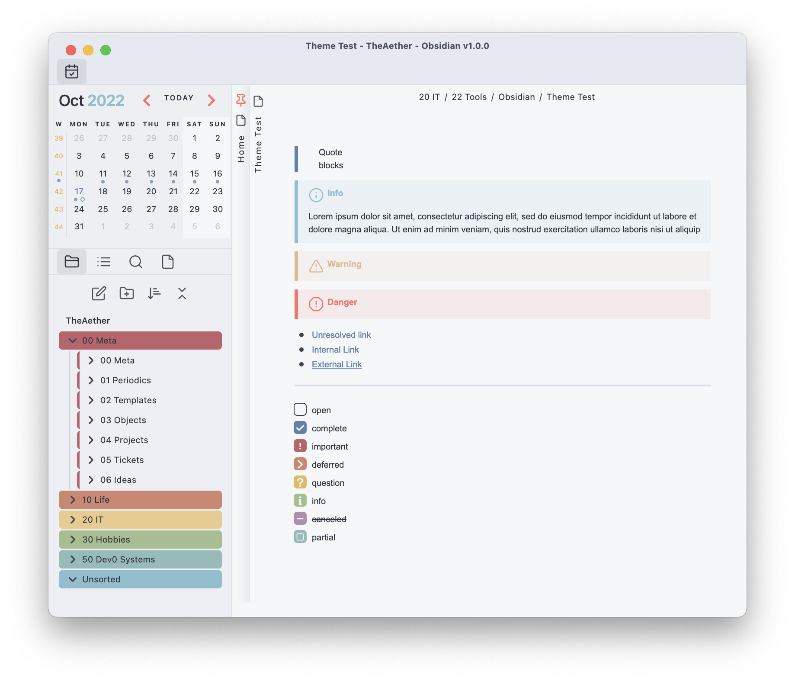

# PLN
## Pipe Loves Nord

This is a personal theme I started creating for 0.16.




## Changes
### Basics
- Fonts are generally smaller
- Stacked titles are flipped 180 degrees, and more compact
- The active editor line and gutter lines are highlighted
- Many icons are removed, I use the command pallete more than a mouse.
	- Sidebar icons are removed
	- Editor icons are removed
	- The statusbar is removed
	- Close icons are removed
	- Tab file icons are removed
- Scrollbars are hidden until hovered over
- A frameless mac window no longer has sidebar icons under the window buttons


### Embeds
- Embeds are stripped of all "indicators" and flow as written text
- H1-3 of embeds are hidden, kind of janky but it works for most cases

### Links
- Internal links are not underlined
- Unresolved links are not transparent, and appear like any other internal link
- External link icons are removed

### Dataview
- Styling is removed like embeds so they flow like written text
- Hide the item count on task lists

### Custom checkboxes
- Completed tasks are not crossed out
- I added various checkboxes that can be seen in the images. 
	```
	- [ ] open
	- [x] complete
	- [!] important
	- [>] deferred
	- [?] question
	- [i] info
	- [-] canceled 
	- [/] partial
	```
- Custom checkboxes can be queried for in DV:
	- Find all Important tasks
	```js
	task from "PATH\PATH"
	WHERE !completed
	WHERE status = "!"
	GROUP by file.link
	```

### Callouts
- Callouts are changed to be closer to pre 0.16 style
- Danger is a unique design now
- Callouts are condensed

### Calendar plugin
- It has been condensed
- More colour

### Folders
- Folder colours are applied automatically, I may change the order or remove some colours that are too close in shade to eachother though.
