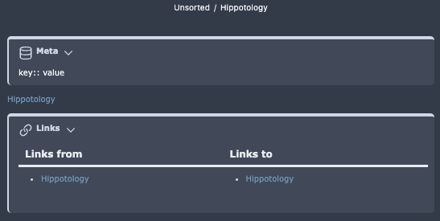

# PLN (Pipe Loves Nord)

Check out my new [Unique tables]() and [Multi-row tabs]()

## Overview
This is a personal theme I started creating for 0.16.

**Please note this theme relies heavily on [Style Settings](https://github.com/mgmeyers/obsidian-style-settings) for the enablement of select features and for opting in/out of various aspects of the UI that I alter.** You can install this community plugin in Obsidian directly. 


## Colours
Below are our colours from Nord and what they are called. Yellow-light and Yellow-dark are a necessary evil to actually have yellow be readable in Light mode, Yellow-light is the true Nord colour.

```css
--color-red: #bf616a;
--color-orange: #d08770;
--color-yellow-light: #ebcb8b;
--color-yellow-dark: #e4b860;
--color-green: #a3be8c;
--color-purple: #b48ead;
--color-sea-green: #8fbcbb;
--color-cyan: #88c0d0;
--color-frost: #81a1c1;
--color-blue: #5e81ac;
--color-salmon: #FC6E68;
```

## Unique changes in this theme
I make many changes that I consider QoL or that are just nifty. Explore the Style Settings options to toggle many of these on or off and discover more features of PLN. You can view the available style settings [here](StyleSettings.md).

### Notable basics
- Fonts are generally smaller
- Stacked titles are flipped 180 degrees, and more compact
- Many icons are removed, I use the command pallete more than a mouse. **All removals can be controlled via Style Settings.**
    - Sidebar icons are removed
    - Editor icons are removed
    - The statusbar is removed
    - Close icons are removed
    - Tab file icons are removed
- Scrollbars are hidden until hovered over
- A frameless mac window no longer has sidebar icons under the window buttons
- Coloured file explorer
- The View icons can be inverted in Style Settings. It never made sense to me that you had the edit icon in reading mode and vice versa.
- Links
    - Internal links are not underlined
    - Unresolved links are not transparent, and appear like any other internal link
    - External link icons are removed

### Embeds
- Embeds are stripped of all "indicators" and flow as written text
- H1-3 of embeds are hidden with options to hide all headers or no headers via [Style Settings](https://github.com/mgmeyers/obsidian-style-settings).

### Dataview
- Styling is removed like embeds so they flow like written text. Edits can be toggled via [Style Settings](https://github.com/mgmeyers/obsidian-style-settings).
- Hide the item count on task lists

### Custom checkboxes (Requires Style Settings community plugin)
- Completed tasks are not crossed out
- I added various checkboxes that can be seen in the images. 
    ```
    - [ ] open
    - [x] complete
    - [!] important
    - [>] deferred
    - [?] question
    - [i] info
    - [-] canceled 
    - [/] partial
    ```
- Custom checkboxes can be queried for in DV:
    - Find all Important tasks
    ```js
    task from "PATH\PATH"
    WHERE !completed
    WHERE status = "!"
    GROUP by file.link
    ```

### Unique tables
Using callouts I have enabled new table types to be presented. 


To create these new types of tables insert a callout and start name with "table-" then you add the various modifiers below.

- bold_row
- plain_columns
- vertical_row

#### Examples from the image
```
> [!table-vertical_row]
> 
> ## table-vertical_row
> |           | Column1 | Column2 |
> | ------- | ------- | ------- |
> | Row1    |         |         |
> | Row2    |         |         |
> 

> [!table-bold_row]
> 
> ## table-bold_row
> | Row0    | Column1 | Column2 |
> | ------- | ------- | ------- |
> | Row1    | content | content |
> | Row2    | content | content |
> 

> [!table-plain_columns]
> 
> ## table-plain_columns
> |  Row0   | Column1 | Column2 |
> | ------- | ------- | ------- |
> | Row1    | content | content |
> | Row2    | content | content |
> 

> [!table-bold_row-plain_columns]
> 
> ## table-bold_row-plain_columns
> |  Row0   | Column1 | Column2 |
> | ------- | ------- | ------- |
> | Row1    | content | content |
> | Row2    | content | content |
> 
```

### Multi-row tabs


### Callouts
- Danger is a unique design now
- Callouts are condensed
- Idea has been added
- Links and Meta have been added
    - **These are considered Legacy with the addition of the native Properties UI**
    - I use them for holding a DV backlinks query and my meta-data as opposed to native frontmatter or the backlinks pane.
    - Both of these callouts can be toggled to appear in Reading and PDF exports.



Query for Links callout
```js
TABLE without id file.inlinks AS "Links from", file.outlinks AS "Links to"
WHERE file.path = this.file.path
```

### Calendar plugin
- It has been condensed
- More colour

### Highlights and text colours
The original snippet came from soggymuse but it only worked in LP. I expanded it to work in Reading view and added many more forms to it.

```markdown
==Yellow==
<mark class='edit'>dfddrtrtrt</mark>
<mark class='unfinished'>I will be going to</mark>
<mark class='verify'>hippos are extinct</mark>
<mark class='important'>april 8th</mark>

<mark class='red'>Red Text</mark>
<mark class='blue'>Blue Text</mark>
<mark class='green'>Green Text</mark>
<mark class='purple'>Purple Text</mark>
<mark class='underline'>Underlined Text</mark>
<mark class='path'>C:\Users\Roo\Foo</mark>
<mark class='borders'>Bordered text</mark>
```

## CSS Classes
You can manually add these classes (or any other Style Settings class) to a note in the "cssClasses" property to selectively enforce a setting.

### hide-properties
In Style Settings you can find a "Hide properties in reading mode" setting. This is controled via the `hide-properties` class,  I use this for my "Home" note.

### lock
This will prevent you from interacting with a note and it will change the reading/editing icon to a lock. Remove the property via the Properties sidebar dialog or command.

## Bonus
If you use [Espanso](https://espanso.org/) the following form can be used to insert marks easily.

```yml
name: obsidian
parent: default
matches:
  - trigger: ";;mark"
    replace: "<mark class='{{form.type}}'>{{form.content}}</mark>"
    vars:
    - name: "form"
      type: form
      params:
        layout: "Mark type: {{type}} Content: {{content}}"
```

## FAQ
### Why remove things when [Kepano's Hider](https://github.com/kepano/obsidian-hider) exists?
I prefer having a minimal number of plugins, so if it can be done with CSS I will use CSS.

### How do you have columns?
I am using [Efemkay's MCL solutions](https://efemkay.github.io/obsidian-modular-css-layout/) which are more CSS snippets to avoid column plugins.
